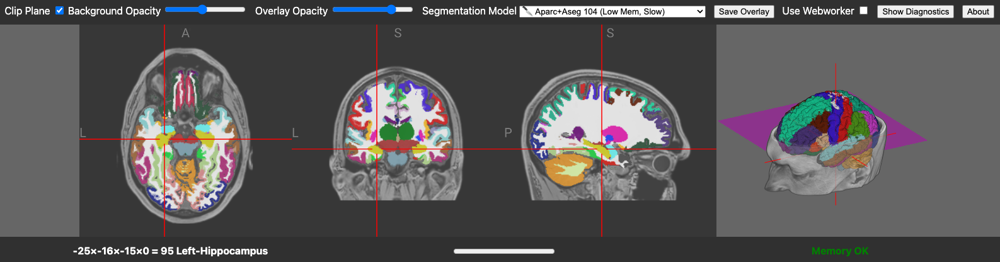

# NiiVue brainchop

<span style="color: red">**This repository is archived. Features developed here have been merged with the main [brainchop repository](https://github.com/neuroneural/brainchop)**</span>

This is an experimental version of [brainchop](https://github.com/neuroneural/brainchop) that uses [NiiVue](https://github.com/niivue/niivue) to segment and visualize voxel based images. 

## Live preview

https://niivue.github.io/niivue-brainchop/

## Getting started

### To run

```bash
git clone git@github.com:niivue/niivue-brainchop.git
cd niivue-brainchop
npm install
npm run dev
```

Use the `Segmentation Model` pull down menu to run different tissue classifications.




### To build

```bash
npm run build
```


